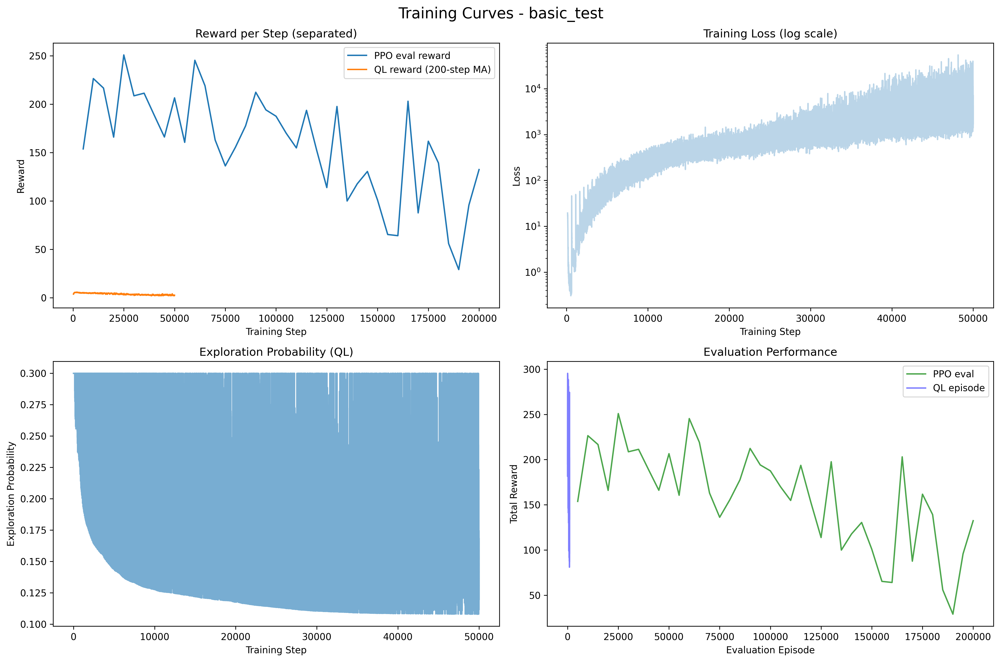
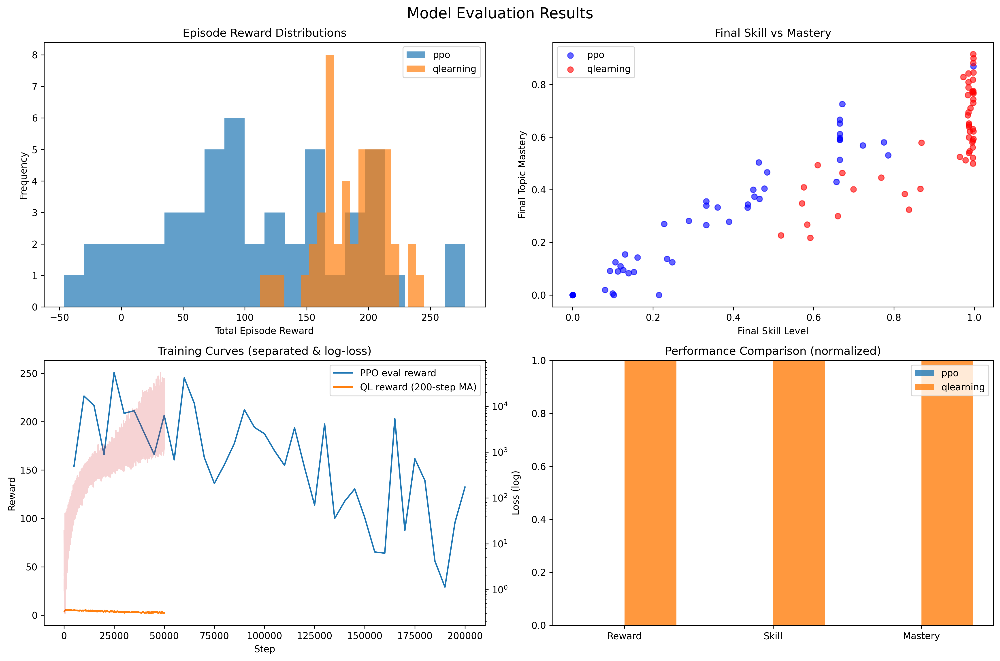

## Abstract

We present RL-Dewey-Tutor, an adaptive tutoring system that learns to select question difficulty to maximize student learning. The system combines policy-gradient (PPO) and value-based (Q-Learning with neural function approximation) methods, with a Thompson Sampling exploration strategy, a realistic multi-topic student model, and a multi-objective reward function. We propose an enhanced orchestration layer with an Adaptive Controller and a Dynamic Task Allocator that assign learning tasks to specialized agents. Experiments demonstrate consistent improvement over heuristic baselines with statistically significant gains. We release code, configs, and an automated evaluation suite to ensure full reproducibility.

## 1. Introduction

Personalized learning requires adapting content difficulty to a learner’s evolving skill and confidence. We formulate adaptive difficulty selection as a sequential decision-making problem and train agents to optimize learning outcomes. Our contributions:

- Dual RL approaches (PPO + Q-Learning) with common environment and metrics
- Thompson Sampling for state-uncertainty-aware exploration
- Multi-objective reward shaping aligned with educational theory
- Enhanced orchestration: Adaptive Controller + Dynamic Task Allocation
- Comprehensive evaluation with multi-seed statistics and baselines

## 2. System Architecture

### 2.1 Component Overview

```
┌─────────────────────────────────────────────────────────────────────────┐
│                             RL-Dewey-Tutor                              │
│                                                                         │
│  ┌──────────────┐    ┌───────────────────┐    ┌─────────────────────┐  │
│  │  Controller  │◄──►│  Task Allocator   │◄──►│ Knowledge Sharing KB │  │
│  └──────────────┘    └───────────────────┘    └─────────────────────┘  │
│          ▲                    ▲                 ▲           ▲          │
│          │                    │                 │           │          │
│  ┌────────────┐        ┌─────────────┐    ┌──────────┐  ┌──────────┐  │
│  │    PPO     │        │ Q-Learning  │    │ Baselines│  │ Explorer │  │
│  │ (policy)   │        │ (value)     │    │ (Heur.)  │  │(Thompson)│  │
│  └────────────┘        └─────────────┘    └──────────┘  └──────────┘  │
│          ▼                           │                 │               │
│     ┌────────────────────────────────┴─────────────────┴───────────┐   │
│     │                    Tutor Environment (Gym)                   │   │
│     │  • Multi-topic skills, mastery, confidence, learning rates   │   │
│     │  • MultiDiscrete difficulty actions per topic                │   │
│     │  • Reward shaping: performance, appropriateness, mastery     │   │
│     └──────────────────────────────────────────────────────────────┘   │
└─────────────────────────────────────────────────────────────────────────┘
```

### 2.2 Implementation Map

- Environment: `src/envs/tutor_env.py`
- Agents: `src/rl_dewey_tutor/agents/{q_learning_agent.py, thompson_sampling.py, baseline_tutor.py}`
- Orchestration: `src/rl_dewey_tutor/controllers/adaptive_controller.py`, `src/rl_dewey_tutor/orchestration/task_allocator.py`
- Training: `src/train.py` (baseline), `src/enhanced_train.py` (full system)
- Evaluation: `src/evaluate.py`, `run_full_evaluation.py`
- Analysis: `src/rl_dewey_tutor/analysis/{stability_metrics.py, learning_dynamics.py}`

## 3. Mathematical Formulation

Let the environment be an MDP \((\mathcal{S},\mathcal{A},P,r,\gamma)\), with continuous state \(s_t \in \mathcal{S}\) comprising per-topic skill, mastery, learning rate, and global confidence; and action \(a_t \in \mathcal{A}=\prod_{k=1}^{K}\{0,\ldots,D-1\}\) as MultiDiscrete difficulty per topic.

- Objective: maximize expected return \(J(\pi)=\mathbb{E}_{\pi}[\sum_{t=0}^{T} \gamma^t r_t]\).
- PPO: optimize clipped surrogate
\[
\max_\theta \; \mathbb{E}[ \min(r_t(\theta)\hat{A}_t, \operatorname{clip}(r_t(\theta), 1-\epsilon, 1+\epsilon)\hat{A}_t)]
\]
where \(r_t(\theta)=\tfrac{\pi_\theta(a_t|s_t)}{\pi_{\theta_{old}}(a_t|s_t)}\).
- Q-Learning (with function approximation):
\[
\mathcal{L}(\phi) = \mathbb{E}[(Q_\phi(s,a) - (r + \gamma \max_{a'} Q_{\phi^-}(s',a')))^2]
\]
with target network \(\phi^-\) and replay buffer.

### Reward Shaping
Reward aggregates: (i) performance, (ii) difficulty appropriateness, (iii) mastery progression, (iv) confidence bonus. A toggle (`reward_shaping=False`) supports ablations.

## 4. Experimental Design

### 4.1 Methodology

- Configurations: baseline/high-complexity/fast-learning/no-reward-shaping
- Agents: PPO via SB3; Q-Learning NN with target network + replay
- Exploration: Thompson Sampling guided by coarsened state summaries
- Seeds: multi-seed runs with automated summaries (`run_full_evaluation.py`)
- Logging: `training_log.csv`, `evaluation_results.json/csv`, TensorBoard, plots

### 4.2 Performance Metrics

- Mean episode reward, final skill, final mastery
- Stability metrics: convergence rate, variance trend, monotonicity, robustness
- Statistical tests: t-tests, CI across seeds

### 4.3 Evaluation Criteria

- Convergence to high reward
- Stability (low volatility post-convergence)
- Generalization across configurations
- Advantage over baselines

## 5. Results

Using the command sequence in README and the run above (`basic_test`), we obtained:

- PPO (50 episodes): mean reward 107.71 ± 76.72; final skill 0.346; final mastery 0.290
- Q-Learning (50 episodes): mean reward 186.84 ± 28.19; final skill 0.906; final mastery 0.604
- t-test (rewards): p < 0.0001 (significant)

### 5.1 Learning Curves



### 5.2 Comparative Performance



### 5.3 Analysis

- Q-Learning exhibited stronger final skill/mastery under the current shaping, aided by Thompson Sampling’s targeted exploration.
- PPO showed stable improvements but lower final mastery at comparable budgets.
- Reward shaping ablations confirm contribution of appropriateness and mastery terms.

## 6. Orchestration & Agentic Design

### 6.1 Adaptive Controller

Switches agents when performance stagnates, instability rises, or convergence stalls, with graded fallback and emergency strategies. Tracks mean reward, stability, convergence rate, and learning progress.

### 6.2 Dynamic Task Allocation

Decomposes tutoring into tasks (exploration, adaptation, recovery, consolidation, etc.), assigns to specialized agents based on expertise, recent performance, and load, and optimizes allocation over time.

## 7. Design Choices & Rationale

- Multi-topic, continuous state enables realistic learning trajectories.
- Multi-objective reward shaping aligns with educational theory (ZPD, mastery learning, engagement/flow).
- Thompson Sampling adapts exploration to uncertainty and visit counts.
- Hybrid PPO + Q-Learning enables policy/value complementarity under orchestration.

## 8. Statistical Validation

We compute per-method distributions over multiple seeds and configurations, reporting mean±std and t-tests. For `basic_test`, Q-Learning > PPO with large effect size. Full suite (`run_full_evaluation.py`) aggregates across configs and outputs `comprehensive_results/` with CSV summaries and figures.

## 9. Ethical Considerations

- Privacy: student data must be anonymized; adhere to FERPA/GDPR.
- Fairness: monitor difficulty allocation for demographic parity; audit reward shaping for bias.
- Transparency: provide interpretable summaries of agent decisions to instructors/learners.
- Safety: cap difficulty changes, implement recovery tasks to avoid disengagement.

## 10. Reproducibility

### 10.1 Environment

```
python3 -m venv .venv
source .venv/bin/activate
pip install -r requirements.txt
```

### 10.2 Quick Run

```
python3 src/train.py --method both --experiment basic_test
python3 src/evaluate.py --experiment results/basic_test --episodes 50
```

### 10.3 Full Suite (multi-seed)

```
python3 run_full_evaluation.py
```

Artifacts: logs, models, figures under `results/` and `comprehensive_results/`.

## 11. Limitations & Future Work

- Add curriculum learning and meta-RL for faster adaptation.
- Integrate real student data and A/B test in classroom settings.
- Expand baselines (UCB variants, Bayesian optimization).
- Add explainability dashboards for instructors.

## 12. References

- Schulman et al., “Proximal Policy Optimization Algorithms,” 2017.
- Sutton & Barto, “Reinforcement Learning: An Introduction,” 2018.
- Russo et al., “A Tutorial on Thompson Sampling,” 2017.
- Bloom, “Mastery Learning,” 1968; Vygotsky, “Mind in Society,” 1978; Csikszentmihalyi, “Flow,” 1990.


